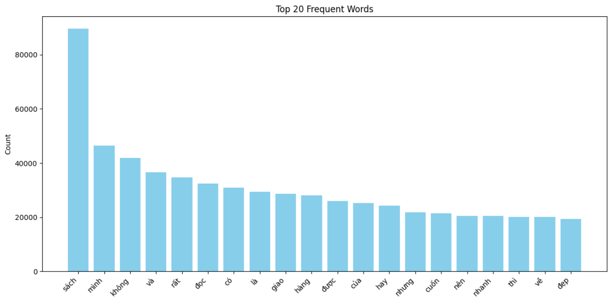
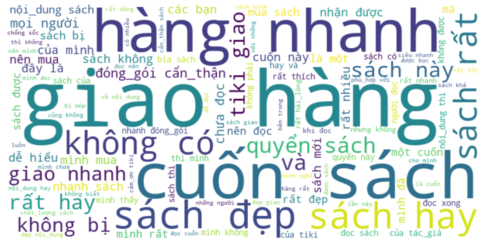
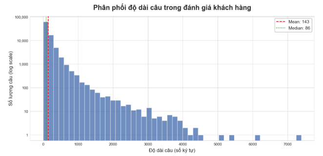
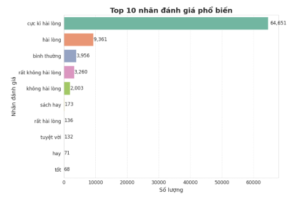
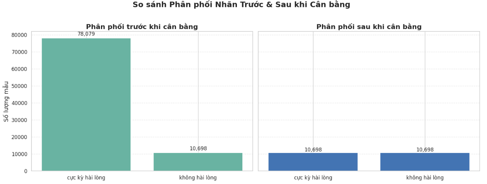
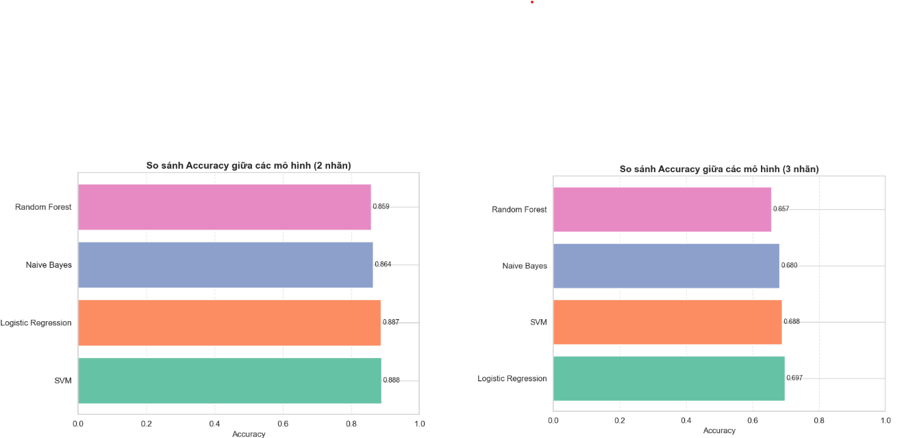
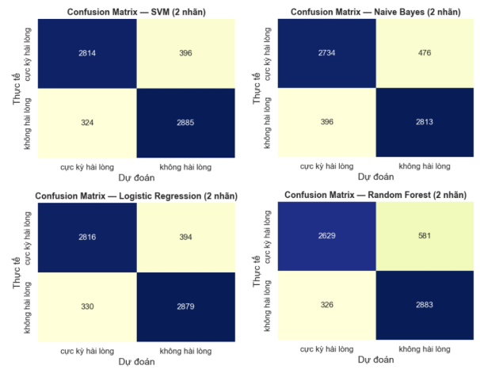
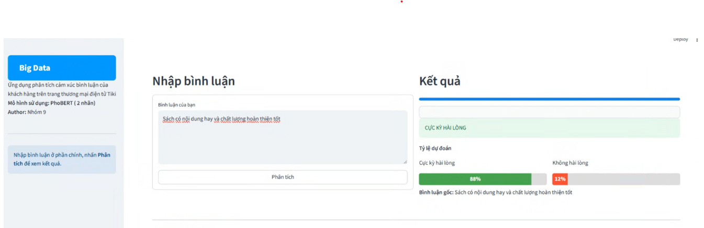

# Tiki Customer Sentiment Analysis: Product Reviews
**Samsung Innovation Campus - Big Data Capstone Project | Team 9**

**Tools & Technologies:** Python, Pandas, Scikit-learn, Underthesea (NLP), TF-IDF, SVM, Logistic Regression, PhoBERT, Streamlit.

## 1. Introduction and Business Value
With the rapid growth of e-commerce, customer reviews on platforms like Tiki contain invaluable insights into consumer sentiment, experiences, and expectations. 

This project builds an automated sentiment analysis pipeline for product reviews (specifically in the Books category) to help businesses:
- Detect product quality issues early.
- Improve customer experience and optimize marketing strategies.
- Make data-driven decisions rather than relying solely on star ratings.

## 2. Dataset Overview
The data was collected from Tiki.vn. After initial cleaning, the dataset consists of approximately **88,000 review records**.

| Field Name | Description |
| :--- | :--- |
| `title` | Short review title (e.g., "Cực kỳ hài lòng") |
| `thank_count` | Number of thank-yous for comments |
| `customer_id` | Customer code (anonymous) |
| `rating` | Rating from 1 to 5 stars |
| `content` | Comment content (free text, containing customer emotions and opinions) |

## 3. Exploratory Data Analysis (EDA) - Before Training
Understanding the raw text data is crucial. We visualized the distribution of words, sentence lengths, and sentiment labels before applying any machine learning models.

### 3.1. Text Characteristics
The word cloud and frequency charts reveal that words like "sách" (book), "giao" (delivery), "nhanh" (fast), and "đẹp" (beautiful) dominate the positive reviews, highlighting that delivery speed and book quality are key satisfaction drivers.

*Figure 1: Top 20 most frequent words in the dataset.*

*Figure 2: Word Cloud showing prominent keywords.*

*Figure 3: Sentence length distribution. The mean length is 143 characters, indicating short and concise reviews.*

### 3.2. Class Imbalance Problem
An initial check on the target variable revealed a severe class imbalance. Positive reviews (4-5 stars / "Cực kỳ hài lòng") accounted for the vast majority of the dataset (76.7% for 5-star ratings). 

*Figure 4: Label and Rating distribution highlighting extreme imbalance.*

---

## 4. Data Preprocessing & Balancing 
To prepare the raw text for machine learning models, we built a comprehensive text processing pipeline:
- **Cleaning:** Removed duplicate records, null values, emojis, and special characters.
- **Normalization:** Converted text to lowercase and applied word segmentation using `Underthesea`.
- **Correction:** Replaced common abbreviations (e.g., "ko" → "không", "sp" → "sản phẩm") and fixed typos.

**Handling Data Imbalance:**
The original dataset was heavily skewed towards positive reviews ("cực kỳ hài lòng" accounted for ~78,000 records). We applied **Undersampling** to balance the classes and prevent the model from blindly predicting the majority class.

*Figure 5: Class distribution before (78,079 vs 10,698) and after (10,698 each) applying Undersampling.*

---

## 5. Feature Extraction & Traditional Machine Learning
We extracted features using `CountVectorizer` and `TfidfVectorizer`, then selected the most important features using `SelectKBest` (Chi-squared).

We experimented with 4 traditional ML models for a 2-class problem (Cực kỳ hài lòng / Không hài lòng):

### 5.1. Accuracy Comparison
**SVM** and **Logistic Regression** achieved the highest accuracy at ~88.8% and ~88.7%, respectively. When expanding to a 3-class problem (adding a "Bình thường" neutral class), accuracy dropped to ~69.7% due to ambiguous semantic boundaries.

*Figure 6: Accuracy comparison across 4 machine learning models.*

### 5.2. Confusion Matrices
For the best-performing SVM model (2-class), it accurately predicted both positive and negative labels with minimal false positives/negatives.

*Figure 7: Confusion Matrices for the 2-class prediction problem.*

---

## 6. Deep Learning Upgrade: PhoBERT
To improve the system's ability to understand the complex context, slang, and nuances of the Vietnamese language, we upgraded our pipeline using **PhoBERT** - a state-of-the-art language model for Vietnamese. The model successfully classified difficult ambiguous sentences with high confidence.

---

## 7. Web Application
We deployed our PhoBERT sentiment analysis model using an interactive web interface. Users can input any product review text and instantly see the predicted sentiment.

*Figure 8: Real-time prediction UI built with Streamlit.*
## 8. Future Directions
Advanced NLP Techniques: Further refine the handling of sarcasm, slang, and unstructured text patterns.

Entity Extraction: Develop capabilities to classify sentiments based on specific topics (e.g., shipping speed vs. product quality).

Automated Data Ingestion: Build advanced web scraping pipelines to constantly update the model with new reviews.
